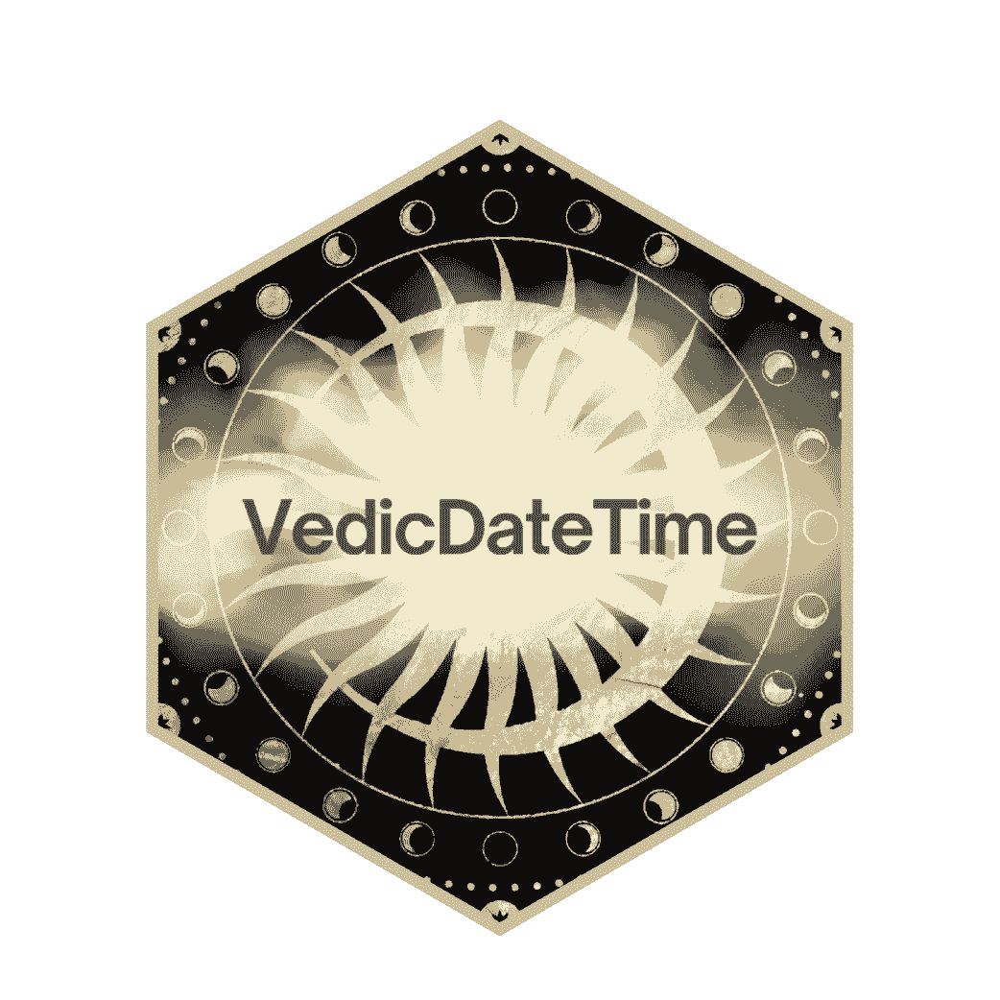
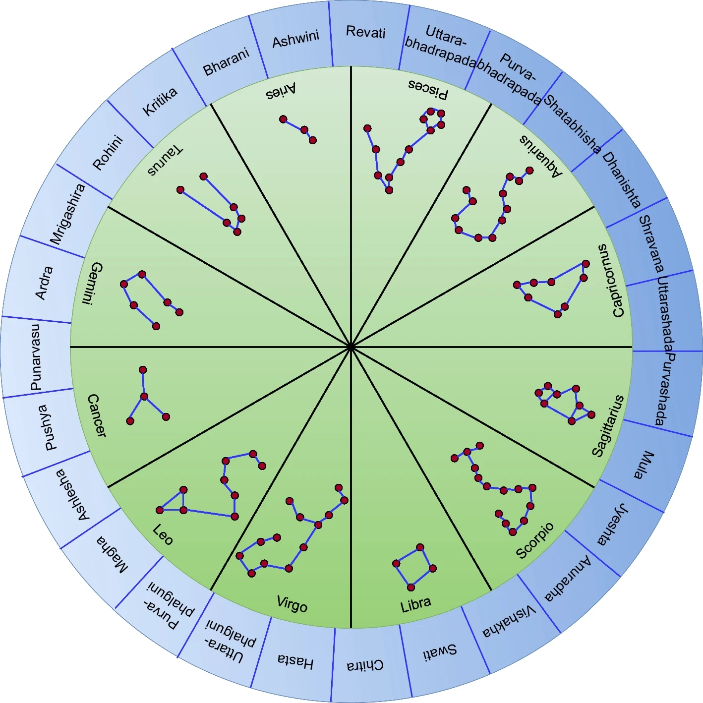

::: {.hero}

{width=160}

<div>

# VedicDateTime

<p class="lead">
An open-source R package to compute key entities from the <b>Vedic (lunisolar) calendar</b> and convert <b>Gregorian</b> dates (or <b>Julian Day Numbers</b>) into <b>Panchanga</b> components such as <b>tithi</b>, <b>vaara</b>, <b>nakshatra</b>, <b>yoga</b>, and <b>karana</b>.
</p>

**CRAN:** [cran.r-project.org/package=VedicDateTime](https://cran.r-project.org/package=VedicDateTime)  
**GitHub:** [github.com/neerajdhanraj/VedicDateTime](https://github.com/neerajdhanraj/VedicDateTime)  
**Paper:** [doi.org/10.1007/s11042-023-16553-w](https://doi.org/10.1007/s11042-023-16553-w)

[Install & first steps](getting-started.qmd){.btn .btn-primary}
[Reference overview](reference.qmd){.btn .btn-secondary}
[API (pkgdown)](pkgdown/){.btn .btn-secondary}

</div>

:::

{fig-alt="Screenshot"}

## Package status

[](https://cran.r-project.org/package=VedicDateTime)

## Why VedicDateTime?

Calendar systems used around the world can be **solar**, **lunar**, or **lunisolar**, based on movements of the sun, the moon, or both. The **Gregorian** calendar (solar) is commonly used as a modern time reference for computation.

The **Vedic calendar** is **lunisolar**. The VedicDateTime paper motivates that a lunisolar calendar can be useful when analyzing activities and time series that may depend on both celestial bodies—especially when studying:

- **calendar seasonality** (seasonal patterns tied to cultural and astronomical cycles)
- **moving-holiday effects** (e.g., festivals whose Gregorian dates shift year to year)

VedicDateTime was designed to make these computations accessible as reliable, reproducible R functions.

## What does the package compute? (Panchanga and related entities)

The paper discusses **Panchanga** (“five arms”), which consists of:

1. **Tithi** — a lunar day (related to the lunar phase)
2. **Vaara** — weekday
3. **Nakshatra** — constellation segment based on the moon’s position
4. **Yoga** — derived from sun + moon longitudes
5. **Karana** — half-tithi

In addition, the package includes related entities and helpers such as **rashi**, **lagna**, **masa**, **ritu**, **samvatsara**, **sunrise/sunset**, **moonrise/moonset**, solar/lunar longitudes, and conversions between **Gregorian** dates and **Julian day numbers**.

## Quick examples (from the paper)

These examples are shown in the package paper. (This website is configured to *display* code but **not execute it** while building pages.)

### Example 1: tithi()

```r
# Julian day number
jd <- 2459778

# Latitude, Longitude, and timezone of the location
place <- c(15.34, 75.13, +5.5)

tithi(jd, place)
#> [1] 20 20 55 35
```

Interpretation described in the paper:

- the first number is the **tithi index** (there are 30 tithis)
- the remaining numbers represent the **ending time** as `hour minute second`

### Example 2: vaara() and names

```r
vaara(2459778)
#> [1] 1

get_vaara_name(2459778)
#> [1] "Ravivar"
```

### Example 3: nakshatra()

```r
nakshatra(2459778, c(15.34, 75.13, +5.5))
#> [1] 25 24 24  1
```

The paper explains this as nakshatra index + ending time.

## Typical workflow

A typical workflow in the paper is:

1. Start with a Gregorian date-time (or directly a Julian day number)
2. Choose a **place** (latitude, longitude, timezone)
3. Compute one or more Panchanga entities
4. Optionally map numeric indices to names (e.g., `get_vaara_name()`)

See [Getting started](getting-started.qmd) for a step-by-step guide.

## Research and applications

The paper includes two demonstrations showing how VedicDateTime can be used in practice:

- **Seasonality analysis** on India’s Index of Industrial Production (IIP)
- **Diwali regressors** to model moving-holiday effects pre/post Diwali

See [Tutorials & case studies](articles.qmd).

## Citation

If you use VedicDateTime in academic work, please cite:

> Bokde, N. D., Patil, P. K., Sengupta, S., Sawant, M., & Feijóo-Lorenzo, A. E. (2023). *VedicDateTime: An R package to implement Vedic calendar system*. Multimedia Tools and Applications. https://doi.org/10.1007/s11042-023-16553-w
